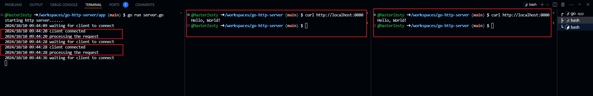
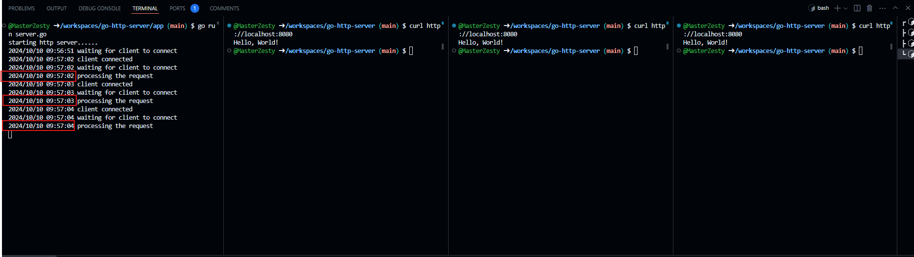

1. In simpler terms http server is software server that understands URLs(web addresses)
and HTTP (Hypertext Transfer Protocol)
2. HTTP is a textual, stateless protocol.
3. Read more about it - 
    1. https://developer.mozilla.org/en-US/docs/Learn/Common_questions/Web_mechanics/What_is_a_web_server
    2. https://developer.mozilla.org/en-US/docs/Web/HTTP
4. 

To DOs -

step 1 : start listening on the port - net.Listen()
- when your process starts pick a port and start listening to it

step 2 : wait for a client to connect - listener.Accept()
- invoke the 'accept' system call and wait for a client to connect
- this is blocking call and server would not proceed until some client connect
- use curl http://localhost:8080

step3 : read the request and send the response
- once the connection is established
- 1. invoke the 'read' system call to read the request - blocking
conn.Read()
- 2. invoke the 'write' system call to send the response - blocking
conn.Write()
- 3. close the connection
conn.Close()

step4 : Do thi over and over again
put the entire thing in an infinite 
for loop
1. continuously waiting for client to connect
2. reading the request
3. writing the  response
4. closing the connection

* till this point the server is single threaded

step5 : multiple request concurrency
- sequential execution and handling
- accepting one, processing and then accepting another

step6: parallelize the processing
- once client connects, fork a thread to process and respond
- let main thread come back to 'accept' as quickly as possible

for {
    accept()
    ~~~~thread~~~~~> process(conn)
}

- use goroutine

- one of the limitations of this approach is what if multiple clients connect to the
server - thread overload

step7 : optimizations/improvements
- limiting the max number of threads
- add thread thread to save on thread creation time
- connection timeout 
- TCP backlog queue configuration

NOTE : there are single threaded server which can handle multiple concurrent requests

References :
1. [Why most TCP servers are multi threaded and how to build one from scratch](https://youtu.be/f9gUFy-9uCM?si=Drp5TFcYd-oEF7q5)